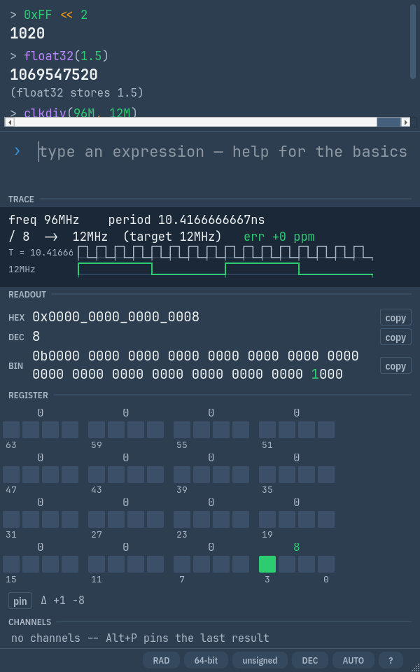

# Radix

Keyboard-first scientific + programmer calculator for engineers, built with
Python and PySide6. Runs on Windows and Linux.




Everything is typed into one input field — no button grids. One unified,
modeless grammar: `**` is always power, `^` is always XOR, and any integer
result automatically shows hex, decimal, binary, ASCII bytes, and a clickable
bit panel — toggling a bit writes the edited value straight back into the
input line, dragging across cells selects a bit range and reads out that
field (`[15:8] = 0xBE = 190`), and bits that changed since the previous value
are outlined. Float results show their IEEE-754 layout (sign/exponent/
mantissa bands) instead of going grey. A live preview under the input shows
the parsed interpretation and the result on every keystroke, before you press
Enter; errors underline the offending span right in the input. Typing a name
pops autocomplete with signatures and summaries (Tab inserts), and `help`
shows every function grouped by category — both generated from the
evaluator's own tables. Toolkit results with something worth drawing (Qm.n
layouts, IEEE-754 fields, clock dividers, memory sizing) get a small
visualization panel — small clock dividers even draw the reference vs
divided waveform with the output's duty cycle.

## Quick start

```sh
uv run radix                 # GUI
uv run radix -e "0xFF << 2"  # one-shot CLI
uv run radix -e help         # the built-in overview
```

Or grab a standalone build (no Python needed) from CI artifacts: unzip and run
`radix`/`radix.exe`. Windows SmartScreen will warn on the unsigned
binary — this is a known v1 limitation. `radix --version` prints the
version; release history lives in [CHANGELOG.md](CHANGELOG.md).

On Linux, Wayland compositors (GNOME Shell in particular) show the running
app's real icon only if a matching `.desktop` file is installed — otherwise
you get the generic executable icon. `uv run radix` and the frozen binary
both already report the right desktop-file id; you need the file itself in
place once: copy `_internal/radix.desktop` to
`$XDG_DATA_HOME/applications/` (defaults to `~/.local/share/applications/` —
check `echo $XDG_DATA_HOME` if you're not sure, some setups override it) and
`_internal/icons/hicolor/*` into `$XDG_DATA_HOME/icons/hicolor/`.
**Its `Exec=radix` line must resolve** — either put the `radix` binary on
your `PATH` (e.g. symlink it into `~/.local/bin/`) or edit that line to an
absolute path. This isn't just about being able to launch it from the file:
GLib refuses to even parse a desktop entry whose `Exec=` doesn't resolve, so
a bad `Exec=` makes the file invisible to GNOME Shell entirely, not just
unlaunchable — which is exactly the same "generic icon" symptom as not
having the file at all. Then `update-desktop-database` on that applications
directory (no logout needed).

## The language

```
> 4.7k * 2                 SI suffixes: f p n u µ m k M G T   (4.7k = 4700)
  9400
> 32Ki                     binary prefixes: Ki Mi Gi
  32768
> hFF + b1010              prefixed literals: hFF/xFF = 0xFF, b1010 = 0b1010
  265
> x = 8'hA5                Verilog/VHDL literals: 8'hFF, 12'b1010_1010, x"FF"
> x[7:4]                   bit slicing and testing: x[3]
  10
> 2**10 + 0b1010           ** = power, ^ = XOR — in every context
> sin(pi/4)                sin cos tan … log ln log2 sqrt exp abs floor ceil round
> clog2(300)               FPGA toolkit: clog2 flog2 mask bit popcount parity
  9                        revbits byteswap16/32/64 sext zext rol ror
> period(100M)             clock helpers, SI-formatted output
  10n
> clkdiv(50M, 115200)      nearest divider with achieved rate + ppm error
  434  (actual 115.207k, error +64 ppm)
> mem(4096, 36)            RAM sizing: address bits, capacity, utilization
  147456  (addr 12 bits, 18 KiB)
> fix(0.7071, 1, 15)       fixed-point Qm.n with quantization error shown
  23170  (0x5A82)
> float32(1.5)             IEEE-754 bit pattern as an integer; unfloat32/64 decodes
  1069547520  (float32 stores 1.5)
> ans / 2                  ans = previous result; variables persist per session
> vars                     list variables (Alt+V); del x removes one
> help <<                  help for any operator or function
```

Notable rules (all covered by tests):

- `4k` is always the literal 4000 — multiplying by a variable `k` needs `4*k`.
  Likewise `hFF`/`xFF`/`b1010` are always literals, so names like `b1` or `x0`
  can't be variables (`bad`, `h2o` etc. still can — their tails aren't digits
  of the base).
- `2pi` is 2·π (implicit multiplication); implicit `*` binds exactly like
  explicit `*`, so `1/2pi` is (1/2)·π.
- `e` is an exponent marker only directly before digits (`1.5e-9`); `2e` is 2·e.
- `/` is true division (stays exact for ints when even), `//` truncates toward
  zero, `%` takes the dividend's sign — C conventions.
- Bitwise/shift operators require integers and wrap register-like at the current
  word size (8/16/32/64, status bar); plain arithmetic is never masked.
- `>>` is logical when unsigned, arithmetic when signed (status-bar toggle).

## Display

Every status-bar item is clickable (or use its shortcut) and takes effect
immediately — existing history entries re-render in place:

- **Result base** (DEC/HEX/BIN, Alt+B): integer results in the history pane
  and live preview render in the chosen base — `1020` ↔ `0x3FC` ↔
  `0b11_1111_1100`. Compact and nibble-grouped; negatives as word-size
  two's complement. Floats are unaffected.
- **Notation** (AUTO/SCI/ENG/ENG·SI, Alt+N): applies to floats *and*
  integers — `10000000` shows as `1e+7` (SCI), `10e+6` (ENG), or `10M`
  (ENG·SI). AUTO keeps integers exact; the hex/bin base wins over notation.
- **Word size / signedness** (Alt+W / Alt+S): reinterprets the integer panel
  and bit grid without re-evaluating anything. At 32/64-bit word sizes, float
  results render as IEEE-754 single/double bit layouts with decoded
  sign/exponent/mantissa rows. The same dissection is available at any word
  size via `float32(x)`/`float64(x)` — the bit pattern as a plain integer,
  with a color-banded field card — and `unfloat32()`/`unfloat64()` decode a
  pattern back to the real value.

Right-click a history entry to copy its result or expression, copy the value
as hex/dec/bin, recall it, or delete it.

All settings — word size, signedness, deg/rad, notation, result base,
always-on-top, window geometry — persist across restarts in a plain INI file
(`%APPDATA%\radix` on Windows, `~/.config/radix` on Linux).

## Keyboard

| Key | Action |
| --- | --- |
| Enter | evaluate |
| Tab / Ctrl+Space | insert / open completions |
| Up / Down | recall history (or navigate completions) |
| Ctrl+L | clear the history view |
| Ctrl+Shift+C | copy last result |
| F1 or `help` | help pane (Esc dismisses) |
| Alt+W / Alt+S | word size / signedness |
| Alt+D / Alt+N | deg-rad / notation |
| Alt+B | result base (dec/hex/bin) |
| Alt+V | variables pane (`del <name>` removes) |
| Alt+T | always on top |
| Alt+I | show/hide the inspector panel |
| Alt+M | cycle theme: auto (follows the OS) / light / dark |
| Esc | dismiss help/variables pane, clear bit-range selection |

`clear` wipes variables and persistent history. History is stored as JSONL in
the platform user-data directory and recalled entries re-evaluate through the
live engine.

## Development

```sh
uv sync                                   # env + deps (uv.lock is authoritative)
uv run pytest                             # golden tables, Hypothesis, pytest-qt
uv run ruff check src tests && uv run mypy
uv run pyinstaller packaging/radix.spec --distpath dist --noconfirm
```

Architecture: `src/radix/engine/` is a headless, UI-agnostic pipeline
(lexer → Pratt parser → AST → evaluator → formatter; mpmath for reals, exact
Python ints for integer/bit math — never `eval`). `session.py` owns all state
and is the only API the UI and CLI call; `Session.evaluate(text, commit=False)`
is the side-effect-free path the live preview uses. Help text is generated from
the same function/operator tables the evaluator dispatches through, so it
cannot drift. UI lives in `ui_qt/` (bundled JetBrains Mono, OFL-licensed;
light/dark follows the OS).
